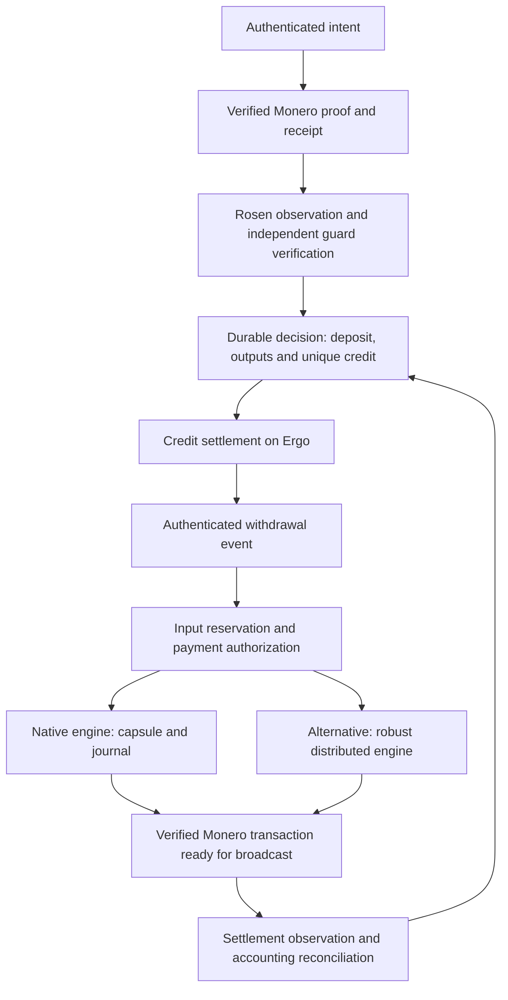

# RFC — Monero Integration into Rosen: Architecture and Implementation Plan

A. Shannon · 11 September 2026 · Technical proposal

## 1. Proposal and intended outcome

This RFC proposes a source-backed integration architecture and a concrete path to implementing it.

Integrate XMR into Rosen while preserving its observation, independent verification, guard agreement and settlement workflow. Add a Monero adapter, a ledger of economic commitments and a signing engine whose authorizations and recovery operations can be verified.

This plan builds on [Bringing Monero](https://docs.rosen.tech/rosen/r-and-d/bringing-monero). The research has produced design solutions for deposit authorization, unique deposit allocation, key-image justification, signature preparation and recovery after incidents. It has also identified a more robust theoretical construction for cases where availability must withstand the disappearance of a transaction's creator. These results make it possible to define specific integration work.

The proposed initial scope is **Monero ↔ Ergo**, with one active vault per configuration, one intent per deposit transaction and one beneficiary per withdrawal. Multiple outputs may fund the same deposit if each is admissible and their sum is exact. Batching, multiple intents within a single deposit and other Rosen destinations follow validation of this workflow.

The intended outcome is a complete cycle: receive XMR, recognize and allocate the deposit, materialize the corresponding credit, accept its withdrawal, pay XMR and recover each interrupted operation without a second credit, a second payment or unsafe nonce reuse.

**Current status: a supported design and primitives tested within a bounded scope. The integrated adapter, new native interfaces and their operational guarantees remain to be implemented.** The validation criteria below are work to be carried out, except where a previous result is expressly identified.

## 2. Established design solutions and their component mapping

| Problem | Design solution obtained | Integration component | Evidence status |
|---|---|---|---|
| Authorize a beneficiary despite the absence of usable Monero metadata | Outbound transaction proof bound to a canonical message; vault receipt verified separately | Intent codec, proof verifier and receipt extractor | Proof/receipt sequence tested locally; durable protocol still to be implemented |
| Prevent multiple credits for the same deposit | Stable deposit and output identities; unique allocation decided through a common order | Economic ledger also consumed by Ergo settlement | Invariant and transitions specified |
| Distinguish receipt from reserves actually available | Output recognition, maturity and spend tracking using justified key images | Vault inventory, binding proofs and chain reconciliation | Source basis and cryptographic construction established; new producer to be developed |
| Bind a real input to its key image | DLEQ proofs for native components, exact public sum and derivation term | Proof producer on the share-holder side, independent verifier on the consumer side | Algebraic argument and native mapping established; no existing threshold API demonstrated |
| Authorize before the first signing contribution | Separate native preparation from initial signing; retain the exact private state in a capsule | Native engine extension, plan validation, then authorized creator recovery | Design and source locations identified; extension not implemented |
| Recover after failure without releasing two authorizations | Durable journal, input reservation, private result followed by durable nonce retirement before exposure | Signing service and conditional transitions in Rosen | Write ordering and recovery cases specified |
| Overcome a blockage caused by an indispensable creator | Agreement with safe recovery and a robust distributed engine; family of mutually conflicting payments | Alternative custody engine behind the same economic contracts | Theoretical possibility under an explicit model; cost and Monero implementation unknown |
| Preserve backing during recovery and rotation | Account for all liabilities, reservations, fees and old payments that remain executable | Reconciliation, vault policy and migration procedures | Economic model established; actual consumers still to be connected |

A native 2-of-4 multisig spend was also executed in a separate scenario. The two native experiments do not constitute an end-to-end Rosen transfer or an availability test with only two participants from setup onward. All four wallets had participated in preparation. Detailed results and limitations appear in the [native validation](monero-integration/technical-basis.md#native-validation).

## 3. Target architecture and first decision

The two engines are **alternatives**, selected through the vault configuration. Their recovery rules are not interchangeable.

| Route | Proposed choice | Conditions and trade-offs |
|---|---|---|
| Strengthened native route | First candidate for a bounded implementation because it reuses the wallet studied | Committee compatible with native multisig, preparation extension, DLEQ, journal and explicit acceptance of possible suspensions if the creator's private state becomes unavailable |
| Robust distributed route | Select if progress despite that failure is an indispensable requirement | Implement a concrete Monero engine with output delivery under the chosen fault model; measure its cost before full integration |

Availability requirements and the custody committee must therefore be fixed at the outset. The observed native limit is sixteen participants; multisig data size also depends on the threshold/committee combination. A 2-of-4 example does not select the Rosen committee.

The agreement group `N_E`, its quorum `Q` and its faults `f_E` are distinct from the Monero custody group `N_X`, its threshold `M_X` and its faults `f_X`. In the model studied, safety requires, among other conditions, `2Q > N_E + f_E` and `M_X > f_X`. Availability in terms of participant counts also requires `Q ≤ N_E − f_E − c_E` and `M_X ≤ N_X − f_X − c_X`, where `c` represents additional unavailable honest participants. These inequalities do not, by themselves, provide a consensus protocol with recovery.

Rosen already has agreement on transaction content. The work is to verify and extend its guarantees for the new commitments, particularly during coordinator changes or restarts. Installing a new consensus protocol is not presumed necessary. [Mapping to Rosen](monero-integration/technical-basis.md#rosen).

## 4. Data and verification contracts

The objects below are proposed logical interfaces. The first work package fixes their exact encoding, versions and conformance vectors before multiple producers are developed.

| Object | Committed content and consumer |
|---|---|
| `VaultConfig` | Networks, vault, epoch, participants and threshold authorities, selected engine, proof profiles, fee/finality/activation rules; verified by all components |
| `DepositIntent` | Domain and version, Monero txid, vault/epoch, destination/asset/beneficiary, gross amount, net amount or exact calculation, fee cap and expiry; consumed by deposit verification |
| `DepositReceipt` | Network/txid, block/height, output indices and keys, amounts in atomic units, vault ownership, maturity and established spend status; reconstructed by authorized observers |
| `DepositDecision` | Deposit, economically consumed outputs, selected intent, credit/fees and agreement reference; consumed by credit payment, including its recovery |
| `InputEvidence` | Real output, configuration commitment, public components, proofs, derivation and full key image; consumed by inventory, construction and signing |
| `WithdrawalAuthorization` | Withdrawal identity, verified extinguishment or immobilization of the source claim, beneficiary/amount, vault, fee budget and reserved inputs; consumed by the payment engine |
| `ExecutionRecord` | Authorized commitment, generations, sessions, durable state, candidates, recoverable results and reservations; logically shared between processor, signer and recovery |
| `SettlementReceipt` | Verified binding between authorization, signed bytes and native hash; accepted inclusion, actual amount/change/fees; consumed to close exactly once |

The deposit is identified by `(Monero network, txid)` and the economic output by `(Monero network, one-time public key)`. The block is a revisable observation. Reinclusion, a second publication on Ergo or a new epoch does not make a deposit available again.

Amounts are integers in XMR atomic units. Any precision conversion must define how the remainder is handled. Addresses, networks and policies are compared against `VaultConfig`, not merely against other fields supplied by the requester. Committed bytes and the data needed to verify them must remain accessible to their consumers; a hash alone does not guarantee that availability.

### Deposit admission

1. Recognize outputs to the vault from a consistent observation of Monero and compute the receipt independently of the published instruction.
2. Verify an **outbound** proof conforming to the selected profile, bound to the txid, vault and `DepositIntent` bytes. `get_tx_proof` produces a transaction proof; `check_tx_proof` verifies it. An inbound proof, which the holder of the recipient's view key can produce, does not authorize the choice of beneficiary in this profile.
3. Verify inclusion, maturity, amount, distinct and usable outputs, fees actually applied and expiry at commitment time. A valid proof replaces none of these checks.
4. Decide the allocation through a common order, then atomically reserve the deposit, outputs and credit obligation before exposing an authorization capable of producing that credit.
5. Materialize the Ergo credit using that same identity. Recovery retrieves the existing obligation and its on-chain effect.

The proof's authority derives from possession of the appropriate transaction secrets; it does not reveal a reliable sender address. `fromAddress` must not be populated with a supposedly reconstructed Monero address.

A subaddress invoice registered **before** payment is a valid alternative: it fixes the beneficiary before receipt and can be funded by anyone. It requires authenticated allocation and no reassignment. It replaces the outbound-authority mechanism; it does not bypass the other checks. For an initial delivery, select only one of these profiles, with the outbound proof proposed as continuity with the article. [Protocol model](monero-integration/technical-basis.md#protocol).

## 5. Justifying inputs and key images

For a real public output `P = xG`, Monero uses `I = x·Hp(P)`. An input reported by a wallet must be bound to this actual key image so that the economic spend actually being signed is reserved.

The proposed construction uses the native components after weighting: `B_j = b_jG`, together with a derivation term `t` satisfying `P = tG + Σ B_j`. Each holder supplies `K_j = b_j·Hp(P)` and a DLEQ proof of the same scalar relation between `(G, B_j)` and `(Hp(P), K_j)`. The verifier checks each proof and the public sum, then computes `I = t·Hp(P) + Σ K_j`.

For its canonical challenge `c`, the Chaum–Pedersen proof checks the equalities `zG = U + cB_j` and `zHp(P) = V + cK_j`. Under the explicit cryptographic assumptions, valid proofs and the exact sum establish the relation between `P` and `I`. Setup authenticity and component attribution remain necessary for the separate custody and availability guarantees.

The producer and verifier must follow these rules:

- Use Monero's native `Hp`, canonical encodings and appropriate subgroup/point/scalar checks; replacing it with another group representation changes the statement.
- Use the native basis of components after weighting, deduplicating copies held by multiple participants. This native correspondence does not replace the proofs and the sum equation.
- Bind the transcript to the proof domain, its version, network, setup, output and component. Handle a zero derivation term explicitly; if that term must remain hidden, use the DLEQ variant for the term `T = P − Σ B_j`.
- Isolate proof nonces from signing nonces. Replication of the same secret component must not produce the same nonce under two different challenges.
- Produce the proofs before finalizing the plan; the plan then commits to their identity. Avoid a circular dependency between the plan hash and a proof needed to construct it.
- Compare the justified key image with the imported one, the one in the selected sources and the one in the signed `vin`. A wallet flag indicating "known" or "complete" does not replace this verified equality.

Native export of full key images is not an existing API for this component proof. A ring proof of size one applied to `B_j` uses a different base from `Hp(P)`; it cannot replace the proof described here. [Construction and native mapping](monero-integration/technical-basis.md#ki).

## 6. Native route: prepare, authorize, sign and recover

### Preparation without an exposable contribution

In the code studied, `transfer` in multisig mode already produces a creator contribution before returning. `do_not_relay` prevents broadcast; it does not provide the "no contribution before agreement" boundary required by this plan.

The proposed extension introduces two new logical operations: `prepare_without_initial_signature`, followed by `restore_initial_signature`. Their final names will be fixed with the native interface; these functions are not RPCs available today.

The first operation constructs and inspects the transaction, freezes its sources and all its private preparation, then returns a plan commitment and a capsule reference. The second runs only after verification of the common authorization, a successful claim on the current candidate and durable reservation of the command and its nonces.

The capsule retains input/output order, local indices, the necessary RingCT/CLSAG data, prepared masks and responses, transaction keys and randomness, wallet generations, participant sets, contribution choices and the creator's nonces. A random seed alone or a reconstruction call is insufficient. Contexts are reconstructed in a typed and verified form, without blindly serializing C++ memory.

Private content, including `cached_w` and nonces, remains secret. An authenticated envelope proves storage integrity; it does not demonstrate that arbitrary private state was computed correctly. Correct local generation, reconstruction checks and storage protection are therefore part of the engine's contract. The insertion points studied are `wallet2.cpp::transfer_selected_rct`, `multisig_tx_builder_ringct` and `multisig_clsag_context`. The differential restoration test must check, among other things, the CLSAG message, local indices and the conversion between the transaction's D point and the point in the native context.

### Journal and result exposure

The mandatory order is:

`result R durably stored in private → durable retirement W of nonces from all new commands → durable authorization A to expose R → exposure of R`.

These steps may use multiple writes if their ordering and durability are established. They do not assume a magically atomic transaction between the wallet and the Rosen database. A write acknowledgment is insufficient if the selected storage guarantee does not cover the failure being considered. The result remains inaccessible to other participants before A: native encryption with a shared view key does not provide that confinement. The backend and its storage barriers are chosen explicitly; terminating a process does not, by itself, test a hardware power failure.

Before the durable selection of `R`, recovery of the computation is permitted only for the same command and exact frozen state, without concurrent execution or nonce reassignment. After that selection, recovery returns the stored result bytes. Every cosigner contribution and every signing path must respect their own nonce constraints and the same economic authorization.

Retirement prevents nonce use for new commands; it does not mean physical erasure of every backup. Private data needed for authorized recovery remains protected. Restoring an old backup requires a freshness authority outside that backup before signing again.

The journal must also enforce effective exclusion of old workers, verify persistence after a partially failed native erasure and account for the global renewal of the nonce pool during a multisig export. Two sessions using different inputs may therefore depend on the same wallet state.

### Uncertainty and availability limit

A timeout, absence from the mempool or `signFailed` leaves a transaction potentially executable. Retain the liability, inputs and authorization until reconciliation. Recovery targets the same plan; it does not select new inputs to pay the same obligation again.

A proposal that has already been exposed cannot be released solely because no local vote exists. After certification, loss of the creator's only usable capsule can block payment. The native route must state this limit and define how suspensions are handled; it cannot promise full Byzantine availability solely on the basis of a quorum of cosigners. [Creator preparation](monero-integration/technical-basis.md#preparation), [durable journal](monero-integration/technical-basis.md#journal), [native refinement](monero-integration/technical-basis.md#preparation).

## 7. Robust alternative: payment family and distributed engine

If the availability requirement rules out dependence on a creator, the authorization covers a family of transactions. It fixes the obligation, a nonempty set of real inputs and their authentic key images, the recipient, the exact amount, the change vault, and a provisioned fee budget.

Each member must spend exactly those inputs, pay the intended recipient, return all change to the vault, and make no other transfer of value. The members share the same real spends: at most one can be accepted in the same valid canonical Monero history.

A robust distributed engine can therefore recover from a lost session with genuinely fresh randomness and produce another member of the same family. The debt and reservations persist. Accounting uses the member actually settled, even if an older candidate reappears after a more recent one. This rule replaces native recovery using the same bytes; it does not implicitly relax it.

The research provides an existence construction based on agreement with recovery and robust multiparty computation. The BGW construction studied uses four participants, one static malicious fault, three available honest participants, and channels satisfying the synchronous model. Its degree-one sharing has a reconstruction threshold of two; the economic quorum of three **does not make it 3-of-4 custody**. A different custody requirement calls for a different, justified construction.

The theoretical result does not provide a CLSAG signer ready for integration. Before selecting this route, a concrete implementation must be chosen, its public/private outputs defined, and its production of only authorized transactions demonstrated despite malicious input. The decisive measurement then concerns a representative transaction: construction/signing cost, communications, memory, recovery, and output delivery under the selected fault. A generic signing benchmark does not discharge this obligation.

Recovery remains conditional on preservation of the shares and state, data availability, liquidity, and inclusion of at least one candidate within the fee budget. The source basis and conditions of this construction are summarized in the [technical appendix](monero-integration/technical-basis.md#robust).

## 8. Integration points in Rosen

The following components were observed in the pinned sources. Implementation starts by comparing these points with the revisions Rosen actually selects as its baseline; their presence in a study does not describe a current deployment.

| Existing boundary | Integration work | Acceptance condition |
|---|---|---|
| Scanner and event extraction | Join instruction and receipt while preserving the Monero txid as the source; keep the Ergo publication separate | A second publication of the same deposit does not create a second credit |
| `EventVerifier` and `AbstractChain.verifyEvent` | Reconstruct proof, receipt, amount, and configuration independently of the Trigger | Guards reject a change to the recipient, receipt, or policy |
| `PaymentTransaction`, payment order, and `getTxDataHash` | Commit to all decision-relevant fields of the plan or family and verify their serialization | Deserialization followed by verification preserves the same authorization over the bytes actually signed |
| Agreement and `DatabaseAction` | Durable reservation before approval, shared uniqueness, and conditional transitions | Two concurrent proposals and a restart cannot produce two incompatible allocations |
| `TransactionProcessor` and external signer | Successfully claim the still-current candidate before any contribution; call the Monero engine | A stale worker or callback cannot sign, replace, or close a different candidate |
| `isTxValid`, tracking, and synchronization | Distinguish established invalidity from uncertainty; link authorization, bytes, and native hash | A missing RPC response leaves reservations in place; synchronization closes only the authorized settlement |
| Ergo settlement and accounting | Consume the same economic identity through to the on-chain effects | Repeating a request or restoring a service does not produce a second external effect |

The adapter entry points in `AbstractChain` include `generateTransaction`, `signTransaction`, `submitTransaction`, and `isTxValid`. Recovery must also cover `processApprovedTx`, `processSignFailedTx`, `processSentTx`, and the responses handled by `eventSynchronization`. The wiring needed to activate the packages, the watcher, and their distribution remains to be inventoried against the baseline selected in L0.

The additional guarantees may belong in the adapter, shared transitions, or, where necessary, on-chain consumers. Each guarantee must have a software component that enforces it. The plan assumes neither that an Ergo contract must change nor that an isolated adapter will suffice. [Sources and detailed mapping](monero-integration/technical-basis.md#rosen).

## 9. Implementation work packages and sequence

The responsibilities below are proposed roles, to be assigned with the maintainers. Each work package delivers its code, data contract, and validation evidence for its boundary. Paths for new components remain to be agreed in the target repositories.

| Work package | Concrete deliverable and proposed owner | Dependencies | Exit criterion |
|---|---|---|---|
| L0 — Profile and technical baseline | Vault/committee/fault/availability decision, intent profile, and engine choice; Rosen maintainers with the custody owner | None | Consistent parameters, pinned integration revisions, defined performance and recovery budgets; no native incompatibility ignored |
| L1 — Contracts and registry | Versioned codec, serialization vectors, identity schema, and registry transitions; adapter and guard service | L0 | Producers/consumers agree on the same bytes; atomic uniqueness and uncertainty states are specified through to external effects |
| L2 — Deposits and credit | Monero extractor, proof verification, Rosen observation, decision, and Ergo settlement; scanner and guards | L1; L3 spend linkage for full admission | Deposit recognized, allocated, and credited once; inbound proofs, concurrent instructions, and inconsistent receipts handled according to the profile |
| L3 — Inventory and DLEQ | Authenticated setup, component extraction, output–key-image proof, verifier, and reserve tracking; Monero engine and cryptographic review | L0–L1 | Correspondence with native data; substituted proofs, components, derivations, and key images rejected at every consumer |
| L4 — Payment authorization | Destination/amount/change/fee verifier, reservation, agreement commitment, and candidate claim; guards and adapter | L1, L3 | Verifier, reservations, durable commitment, and conditional claim validated; engine invocation contract verified; no source withdrawal leaves a claim simultaneously reusable |
| L5N — Native engine | Separate preparation, capsule, restoration, and durable journal; Monero engine | L4; bounded study of native integration points possible from L0 | Transaction matches the frozen data, recovery from every interruption at a write boundary, exclusion of stale workers, and inability to reassign a committed nonce |
| L5R — Alternative robust engine | Concrete implementation of the vault and family functionality; distributed cryptography team | L0–L1 for cost screening; L3–L4 for integration | Acceptable cost and output delivered under the selected faults; only candidates from the authorized family are produced |
| L6 — Settlement and recovery | Integration of `isTxValid`, tracking, synchronization, debt/reserve reconciliation, and rotation; guards and operations | L2, L4, L5N or L5R | The normal path and all recovery paths close the same obligations, including a reappearing old payment and an old backup |
| L7 — Integrated validation | Isolated bidirectional flow, targeted faults, load with the selected committee, and operating procedures; integration and independent review | L6 | All criteria in Section 11 are satisfied on the exact candidate versions |

Common path: `L0 → L1 → {L2, L3} → L4 → selected engine → L6 → L7`. L2 can develop extraction and the codec in parallel with L3; full admission awaits the required inventory checks. The guarantee covering actual contributions, including the creator's, is established at the **L4 + L5N** or **L4 + L5R** integration boundary: L4's invocation contract alone does not validate the engine's behavior. Feasibility screening for the selected engine starts early, before investing in the entire flow.

The first useful increment is **intent → verified receipt → durable decision → unique Ergo credit**, with the inventory contract defined. The second is **authenticated withdrawal → justified inputs → authorization → signature**. The third completes recovery, reconciliation, and the vault lifecycle. This sequence avoids confusing a successful RPC call with completion of an increment.

## 10. Reserves, confidentiality, and vault lifecycle

The reconciled registry must maintain `B ≥ L + P_w + U_c + F_b`: controlled reserves `B`, circulating redeemable claims `L`, withdrawals owed `P_w`, recognized deposits/credits not yet materialized or still requiring resolution `U_c`, and provisioned fees `F_b`. Each amount is counted only once. A signed candidate does not close a debt; the accepted settlement determines the reserve outflow, change, and actual fees. Immediately usable liquidity is checked separately from temporarily locked reserves.

A view key enables receipt recognition without granting spending authority. It is insufficient to derive a complete spendable balance without the appropriate key-image feed. The allocation of information among watchers, guards, and public data must be decided: publishing intents and sharing output–key-image relationships reveals links in the bridge flow. Their confidentiality is not automatic.

The proposed lifecycle is: completed and verified setup, vault activation, stopping new allocations during rotation, draining reserves and handing over the obligation inventory, then monitoring late deposits. Changing the committee on Ergo revokes neither old Monero keys nor transactions already signed. The new vault does not repay a debt that the old vault can still settle.

A refund uses an authorized destination and rules out any credit that can still be executed. The absence of a recoverable sender address prevents “automatically return to sender” from being defined as a general rule.

Policies for both chains' finality, fees, operating reserves, admissions, and incident handling must be set before activation. A finite number of confirmations provides no absolute guarantee against an arbitrarily deep reorganization. The assumptions about accepted histories and the economic treatment of losses must be explicit.

## 11. Decisive validation and delivery conditions

Tests focus on the new guarantees. The native trials already completed provide a baseline; repeating them without changed inputs does not validate the durable protocol.

| Gate | Required verification | Decision on failure |
|---|---|---|
| G0 — Compatibility of the choice | Committee, threshold, fault model, data volume, and recovery compatible with the selected engine | Reconsider the choice before developing the complete flow |
| G1 — Authority and uniqueness | Two concurrent valid intents; republication; reinclusion; output already allocated; interruption between commitment and destination credit | Correct the registry and its consumers; no credit materialization while this gate remains open |
| G2 — Authentic inputs | Fixtures with isolated substitution of output, component, derivation, proof, network/setup, and key image; comparison with the native reference | Reject the input and correct the relevant producer or consumer |
| G3 — Signing boundary | Creator included; incorrect destination, change, fees, sources, stale candidate; check the link to the signed bytes | Block any contribution under a nonconforming commitment |
| G4 — Failures and concurrency | Interruption at every R/W/A boundary; failed write; stale worker; lost result; global nonce export; old backup; proposal exposed and then abandoned | Pause without new authorization, then establish recovery that preserves the invariants |
| G5 — Payment and reconciliation | Transaction withheld and then reappearing; missing RPC response; late callback; repeated withdrawal; inconsistent synchronization; withdrawal during migration | Preserve debts and reservations until a justified resolution; no closure based on a merely plausible payment |
| G6 — Flow and capacity | Monero–Ergo round trip, admitted multiple outputs, fees/change, maturity, exact committee, load, and unavailability under the selected profile | Measure the limit or explicitly reduce the scope; do not promise a service level that has not been achieved |
| G7 — Final candidate | Independent review of cryptographic/economic boundaries, pinned versions, shutdown/restoration procedures, and results applicable to the same bytes | Retain prototype status while any mandatory guarantee remains unresolved |

For the robust route, G4 includes output delivery despite the covered fault and recovery with fresh randomness within the same family. For the native route, G4 verifies safe suspension when the indispensable capsule is missing; this result does not satisfy a requirement for progress despite loss of the creator.

Numerical cost and latency criteria are set in L0 by the service requirements. The first measurement targets the case that could disqualify the engine choice. If the committee is incompatible, the cost exceeds the budget, or a required guarantee depends on an actor whom the model allows to disappear, stop that route and reconsider the choice. A broader campaign does not precede resolution of this gap.

Delivery can be presented in verifiable stages: accepted design, validated components, isolated integrated flow, pilot operations under defined limits, then activation after the applicable gates are closed. **The outcome of this research supports a precise engineering plan; it does not yet attest to these execution stages.**

## 12. Decisions for maintainers and technical dossier

The first discussion with Rosen can focus on three decisions:

1. What committee and availability must be guaranteed, particularly after a transaction creator disappears? This determines whether the native route is admissible.
2. Which deposit profile should the first delivery use: an outbound proof bound to the instruction, or an invoice with a subaddress allocated before payment?
3. Which existing components should enforce durable commitments and economic idempotency, and which maintainers should own their consumers?

The objective is to adopt an architecture, assign L0–L1, and select the first increment. Discussion of other destinations and the delivery schedule follows the engine choice and its initial cost screening.

### Revisions examined

| Source | Revision and entry point |
|---|---|
| Rosen article | [Bringing Monero](https://github.com/rosen-bridge/docs/blob/d7173e50dcc180012f5a14d81030a0c3833a8849/r-and-d/bringing-monero.md) |
| Monero | [`4f92268d7c16741cfb41e5bbe2aa46cc260a9ea5`](https://github.com/monero-project/monero/tree/4f92268d7c16741cfb41e5bbe2aa46cc260a9ea5): `src/wallet/wallet2.cpp`, `src/multisig/`, `src/crypto/crypto.cpp`, `src/cryptonote_basic/cryptonote_format_utils.cpp` |
| Rosen guard-service | [`1edc2fb982de4560c5265e04e2ed8b93d00b40df`](https://github.com/rosen-bridge/guard-service/tree/1edc2fb982de4560c5265e04e2ed8b93d00b40df): `services/guard-service/src/verification/eventVerifier.ts`, `src/transaction/transactionProcessor.ts`, and `src/db/databaseAction.ts` within that service; `packages/abstract-chain/lib/abstractChain.ts` |
| Rosen sign-protocols | [`e8b6fb0a0f6dda7813d885b142f0bd11c9578867`](https://github.com/rosen-bridge/sign-protocols/tree/e8b6fb0a0f6dda7813d885b142f0bd11c9578867): `packages/tss/lib/tss/tssSigner.ts` |
| Rosen scanner | [`7d008b2dc9e2deeea830a890643e2edc82896114`](https://github.com/rosen-bridge/scanner/tree/7d008b2dc9e2deeea830a890643e2edc82896114): `packages/abstract-observation-extractor/lib/extractor/abstractObservationExtractor.ts` |
| Rosen contract | [`1b892c43f2d45eb6916f35e2edbb7560a4569f8e`](https://github.com/rosen-bridge/contract/tree/1b892c43f2d45eb6916f35e2edbb7560a4569f8e): `Lock.es` and `GuardSign.es` contracts, particularly the threshold authorities |

### Supporting technical references

- [Economic identity and protocol obligations](monero-integration/technical-basis.md#protocol): authority, conservation and finality; the proposed transitions and rotation rules are in RFC sections 4 and 10.
- [Rosen consumer mapping](monero-integration/technical-basis.md#rosen): pinned files, existing guarantees and proposed integration boundaries.
- [Native preparation](monero-integration/technical-basis.md#preparation) and [durable signing/recovery](monero-integration/technical-basis.md#journal): source boundaries supporting the proposed contract in RFC section 6.
- [Output–key-image construction](monero-integration/technical-basis.md#ki) and [robust alternative](monero-integration/technical-basis.md#robust): native mapping, proof references and fault-model assumptions. Primary MPC reference: [Asharov–Lindell, corrected full BGW proof, revision 5 of 12 June 2022](https://eccc.weizmann.ac.il/report/2011/036/revision/5/download).
- [Native experiment evidence](monero-integration/technical-basis.md#native-validation): the two separate scenarios, observed results and scope limitations, with the unchanged execution record.
