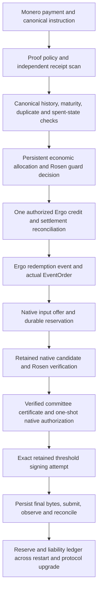

# Monero–Rosen integration: architecture, demonstrated boundaries and remaining work

A. Shannon · Preliminary feasibility study · 13 September 2026

## 1. Decision and scope

The evidence supports continuing toward a Monero integration with Rosen without
replacing threshold custody with a single trusted spender. It does not support
launching a bridge or announcing that every technical problem is solved.

Three conclusions have different strengths:

1. **Concrete feasibility of important components:** existing code can scan
   synthetic Monero receipts, construct and threshold-sign a complete current
   protocol transaction, preserve completed transaction bytes, and feed a
   retained native candidate into actual Rosen transaction consumers.
2. **Conditional architectural feasibility:** a design connects these components
   through explicit authorization, reservation, accounting and recovery rules.
   No decisive impossibility was found for that design under its stated trust
   and availability assumptions. This is not a universal existence proof.
3. **Complete deployed feasibility:** unresolved. No single executed scenario
   yet joins authoritative source observation, distributed Rosen approval,
   retained Monero ownership, signing, canonical settlement and cross-fork
   recovery of the same economic obligation.

Completing a preliminary study means deciding whether there is an investable
engineering path, explaining what it requires, and specifying when to stop.
Completing the implementation requires executing those remaining paths. The
distinction avoids treating an expanding collection of component tests as a
substitute for the final system.

The recommendation is **proceed with a bounded prototype; keep launch closed**.
The candidate engine deserves further work, with FCMP++/Carrot compatibility
treated as a first-class selection criterion. No monetary launch cap, timeline,
production committee size or assurance certification follows from this study.

The inspected evidence does not establish a need to wait for FCMP++/Carrot
activation before implementing the bridge. Duplicate-output accounting and
general custody/recovery obligations do not, by themselves, justify waiting.
The exact engine's migration compatibility can be investigated and tested on
candidate versions before activation. A pre-fork launch remains conditional
on the bridge's complete acceptance criteria and continued redemption; it is
an engineering and operating decision, not a demonstrated protocol impossibility.

## 2. What the original proposal establishes, and what it misses

Rosen's article identifies a useful direction: threshold vault custody and an
Ergo-side instruction bound to a Monero payment proof. Its examples are an
exploration of that direction, not a production integration specification.

The article calls the mechanism a spend proof while using `check_tx_proof`.
It also uses wallet balance/transfer reporting where a bridge requires explicit
receipt accounting. Its concluding production assessment therefore understates
authorization, duplicate-output, recovery and version-transition work.
[Original article](https://docs.rosen.tech/rosen/r-and-d/bringing-monero).

Transaction proofs and spend proofs have separate RPCs and authority semantics.
Checking a transaction proof verifies the relevant proof relation; it does not
by itself establish that only the intended depositor could authorize a bridge
instruction, nor that the indicated amount remains usable backing. An inbound
transaction proof can involve recipient view-key knowledge. The initial
restricted route must accept and cryptographically verify an outbound proof,
not simply accept either direction or check a text prefix. Actual spend-proof
verification is a different operation.
[Wallet RPC reference](https://www.getmonero.org/resources/developer-guides/wallet-rpc.html).

Two concrete script defects also deserve correction before reusing the examples.
The readiness loop calls `is_multisig` repeatedly without switching wallets
inside that loop. It therefore does not demonstrate that every wallet is ready.
The spending loop exports a wallet's multisig data and immediately imports that
same export into the same currently open wallet; it does not demonstrate an
exchange of all required peer exports. Equal addresses alone are insufficient
evidence of synchronized, spend-capable state. These are source-level findings
about the displayed examples, not newly executed wallet experiments.

## 3. Trust model and system boundary

The design retains Rosen's watcher/guard model. Watchers collect qualifying
events; guards verify the evidence and decide whether a payout or credit is
authorized. Monero consensus is not moved into an Ergo contract by embedding
a proof string. Node observations, inclusion/currentness policy and threshold
custody remain distinct responsibilities.

The implementation must distinguish:

- **Approval quorum Q:** the Rosen committee decision authorizing a candidate.
- **Custody threshold M of N:** the Monero shares needed to spend vault funds.
- **Observation/finality policy:** the chain history on which that decision rests.

Q need not equal M. Some APIs describe polynomial degree rather than the number
of required signers; copying an integer between them can silently change the
threshold. Committee identity must bind the Rosen approval keys to the intended
native participant and epoch configuration. A successful 2-of-4 laboratory
example says nothing about the eventual production configuration's capacity.
[Rosen guard configuration](https://github.com/rosen-bridge/guard-service/blob/1edc2fb982de4560c5265e04e2ed8b93d00b40df/services/guard-service/src/handlers/guardPkHandler.ts),
[signing adapter](https://github.com/rosen-bridge/sign-protocols/blob/e8b6fb0a0f6dda7813d885b142f0bd11c9578867/packages/tss/lib/tss/tssSigner.ts).

Safety means no unauthorized credit or payout and no duplicate economic
allocation. Liveness means valid obligations can eventually be discharged under
the specified participant/network failure model. A system that safely refuses
every request is not a usable bridge. A threshold wallet that cannot recover
from a permitted coordinator loss may also fail the chosen service model.

Threats include contradictory instructions, duplicated output keys, stale chain
state, malicious or missing participants, conflicting input selection, partial
writes, lost responses, stale workers, old backup restoration and software
upgrades. Byzantine agreement and custody assumptions must be explicit; local
private objects and SQLite transactions do not supply distributed consensus.

## 4. Complete target architecture

The diagram is the target system, not a diagram of an already completed test.
The evidence ledger identifies the executed subpaths and missing joins.

Separate protocol-specific scanning/proof/signing engines from stable economic
rules. A protocol upgrade may replace output decoding and signing messages,
but must not reset an output's prior-credit status, discard liabilities or make
a still-executable old payout disappear from accounting.

## 5. Deposit instructions: two deliberate product routes

### Restricted sender-proof route

For the first bounded implementation, capture a canonical instruction that binds
version, network, vault/epoch, source transaction and eligible outputs, destination
network/asset, recipient, amount/fee policy and expiry semantics. Specify exact
signed bytes. JSON parsing alone is not canonical signing.

Accept only the reviewed outbound proof profile, initially `OutProofV2`, and
verify the actual proof against those bytes and the intended vault destination.
Possession of the transaction secret keys is the authority assumption; it is
not recovery of a public Monero sender address. Independently scan and open the
eligible outputs, verify amounts/commitments and apply the chain policy.

Two different valid instructions may be created by the same key holder. Resolve
them through one persistent economic allocation and an agreed conflict rule.
Hashing both instructions correctly does not choose between them. A helper may
relay the proof and instruction without being able to change their destination.

This route has a real usability limit: the payer must have suitable transaction
keys/proof tooling. Exchange withdrawals, lost transaction keys and hardware
wallet support cannot be assumed. An actual spend-proof route can be evaluated
separately when input-owner authorization is required; receipt verification is
still necessary.

### Authenticated invoice route

For broader ordinary-wallet compatibility, register a unique vault subaddress
and its immutable instruction before payment. Paying that invoice funds its
fixed beneficiary. The bridge does not need to infer who sent the payment.

This can remove dependence on post-payment sender-proof generation. It adds an
allocation protocol: independent address derivation/ownership checks, an agreed
registration record, never-reused address mapping, reconstructible scan indexes,
and defined dust, partial, excess, expired and late-payment treatment. Expiry
must never permit reassignment to another beneficiary.

An integrated-address/payment-ID variant is another option, with finite identifier
space, uniqueness enforcement and wallet/batching limitations. Neither invoice
nor integrated-address support is an automatic fallback: changing attribution
semantics changes the product contract and requires its own acceptance tests.

The initial recommendation is to keep the tested restricted-proof route as the
reference implementation, while treating authenticated invoices as a separate
product decision. Do not require users to trust an arbitrary server's statement
that a returned address belongs to the vault.

## 6. Burning bug and usable backing

Monero's historical burning bug exploits repeated one-time output public keys.
Different reported receipts can correspond to the same spending identity. A
transaction-ID-only credit ledger can therefore issue multiple claims against
less usable backing than it records. The official account describes the exchange
accounting failure and duplicate-key handling.
[Monero post-mortem](https://www.getmonero.org/2018/09/25/a-post-mortum-of-the-burning-bug.html).

The bridge must distinguish three identities:

| Identity | What it identifies | What it cannot establish alone |
| --- | --- | --- |
| Transaction/output occurrence | Where a reported output appears in chain history | Unique spending entitlement |
| One-time output key P, scoped to network | Conservative duplicate-output exclusion | Maturity, amount, canonical inclusion or complete spent state |
| Proven key image/spending entitlement | The corresponding spend identity under a verified setup | Beneficiary authorization or finality |

The proposed conservative policy is:

1. Repeated notification of the same immutable occurrence returns its stored
   disposition; it does not create another credit.
2. A different occurrence sharing `(network, P)` becomes a conflict. Do not issue
   incremental credit merely because the wallet reports a new or larger amount.
3. Retain aliases and quarantine affected uncommitted credit/new spending while
   reconciling the actual backing. Do not spend an arbitrary duplicate occurrence.
4. If a conflict appears after credit, preserve the holder's claim, quantify the
   exposure and invoke a recovery policy. Freezing does not repair a deficit.
5. A rescan, reorg, wallet restart, new vault epoch or new proof digest must not
   create a fresh economic allocation for the same entitlement.

A complete canonical scan and correctly attributed key-image/spent evidence
are prerequisites for claims about usable reserves. Ordinary incoming-view
access cannot be advertised as a complete spend-aware reserve audit.

The local deposit experiments include distinct accepted fixture transactions
with the same P, native amount/commitment opening, and rejection before durable
credit preparation. This is stronger than testing a fabricated duplicate flag.
It is still not an exhaustive live-chain scan or a complete reorg/solvency
demonstration. Armeanio's warning is therefore a substantive accounting
requirement, not proof that a bridge is impossible.

The exclusion rule is straightforward; its persistent integration must handle
the post-credit and canonical-history cases above. This is a scoped accounting
obligation with targeted test evidence, not an identified need for a new
cryptographic construction. Carrot may simplify part of that work, but the
burning issue alone is not an established reason to defer integration.

Use an accounting invariant such as `usable reserves >= outstanding obligations
+ required fee cover`, with mutually exclusive categories. An in-flight payout
must be represented once: either within outstanding redemption liability or
within a pending-settlement liability, not both and not neither. Encumbered
inputs cannot back another allocation. A reorg may create a shortfall; the
ledger must report it and stop actions that deepen it rather than deleting debt.

## 7. Custody engine: why monero-wallet is useful

The published `monero-wallet` 0.2.0 package provides current-protocol wallet
functionality and an optional threshold signing path. It does not provide a
complete stateful bridge wallet service: Rosen must own acquisition, reservations,
authorization, durable sessions and recovery. Its guaranteed-address scanning
mode requires a compatible sender/derivation; it is not a universal switch for
ordinary Monero payments. Its package and optional multisig interface must be
pinned rather than treated as an interchangeable future wallet.
[Published package source](https://docs.rs/crate/monero-wallet/0.2.0/source/src/lib.rs).

The work established a concrete PedPoP Ed25519 DKG → threshold keys → wallet
signer path without modifying upstream cryptographic sources. An exact dependency
selection was necessary: early combinations failed compilation. The successful
lock retained distinct compatible multiexp versions for their respective
consumers; it did not weaken a cryptographic check to make the build pass.

Subsequent experiments executed a 2-of-4 ceremony, signatures from two subsets,
ordinary encrypted receipt scanning and a complete two-signer transaction with
a controlled 16-member ring. Recipient, change, fees and cryptographic proofs
were checked. These are real library operations over synthetic chain/funding
data. They do not establish a distributed production ceremony or reliable
operation for a larger committee.

PedPoP requires all ceremony participants and a completion-agreement condition.
The tested caller modeled that final barrier. Authenticated pairwise channels
alone do not prevent equivocation; completion consensus, roster changes, retry
policy and transport remain service obligations.
[PedPoP implementation](https://docs.rs/crate/dkg-pedpop/0.6.0/source/src/lib.rs).

Native wallet2 remains a comparison route, especially its future multisig work.
Its experimental designation is a maturity signal, not a mathematical
impossibility result. The actual decision is whether a selected implementation
supports Rosen's threshold, availability, transaction policy, persistence and
upgrade requirements. Neither a generic FROST signature nor an experimental
warning answers all of those questions.

## 8. Key images, native identity and exact signing

For current-protocol spends, the bridge needs to bind each key image to the
actual vault output under the intended threshold setup. A digest of an image
list or a row-count receipt cannot supply this relation.

The tested construction verifies component proofs, participant/subset context,
output identity and interpolation. For a simple additive output offset d,
the relation has the form `P = (x + d)G` and `I = (x + d)Hp(P)`; distributed
contributions must reconstruct the intended group term and add the offset
exactly once. Derivation and hash mode are protocol-specific. This relation
does not establish inclusion, amount, maturity or unspent status.

One corrected fixture originally funded two view-key identities while claiming
a single vault. The repaired fixture constructs the complete vault once and
uses it across all funding batches. This matters because equal spend-group
keys do not prove equal complete wallet identity.

The retained-owner experiments bind the genuine native object to its unsigned
body, signature message and separately private semantics. The exact native
object moves into the wallet's multisig machine; its original generated
preprocess and verified remote map remain retained. Public decoding can validate
syntax/checksums but cannot create that ownership.

Key-image sorting must preserve ring association. Checking only a sorted image
list while leaving rings in another order would verify or sign the wrong
relationship. The two-input tests deliberately exercise nonidentity ordering.

The wallet signing API generates its own message and requires an empty external
message. Passing an asserted approved message would not enforce equality.
The future signing join should therefore preserve the exact native/preprocess
ownership chain and the pinned common unsigned constructor, then independently
verify each final CLSAG against the original admitted message and corresponding
ring/image/pseudo-out. Removing signatures and prunable pseudo-outs should
recover the exact approved unsigned body. Wrong-message and swapped-ring
controls make the verification discriminating.

This is a proposed next proof, not an executed approval-to-signing result.
Final verification happens after shares exist and cannot replace the pre-share
ownership proof. If the contract instead requires a runtime interception of
the internally generated message before any share, a narrowly reviewed wallet
API change is needed. A verification path using the same crypto library is
not an independent Monero implementation.

## 9. What has been joined to Rosen

The latest accepted local checkpoint connects an actual retained native
candidate host to real Rosen `PaymentTransaction`, `AbstractChain`, `TokenMap`,
serialization and common verification. It exercises consistency, fee,
no-token-burn and extra-condition checks, rather than replacing them with
fixture success booleans. Unsupported signing/network operations reject.

Admission is private to the owning child-process launcher. Branded immutable
transactions expose copied bytes and fresh nested payment data. Synchronous
consumers and asynchronous checks reject revoked, replaced or inconsistent
candidates. Canonical JSON can rehydrate an already admitted live candidate;
it cannot admit an arbitrary matching tuple.

Final author and independent consumer suites each passed 41 tests in 11 cases.
The native review also exercised malformed requests and terminal lifecycle
controls. A holder-destruction probe distinguishes actual retained signing
machines from a process that merely stays alive. The result does not establish
memory zeroization or protected production custody.

Two remaining joins are decisive:

**Request/reservation → retained owner.** The latest host uses a fixed synthetic
request. Earlier W1a work derives an unapproved request through actual EventOrder;
the reservation registry commits exclusion before native construction, but that
older constructor closes its process at completion. A new retained path must
connect them without admitting the candidate before the reservation commits.
The callback must actually run in that invocation. A prior completed row,
duck-typed registry, replayed receipt or public tuple cannot recreate authority.
The wire contract is prepared; implementation and tests are pending.

**Verified Rosen agreement → native authorization.** Separate C1b work captures
immutable candidates/committees, validates certificate signatures and tests
creator/receiver paths. Its final database insertion is not a native spending
capability. The next consumer must issue and consume one-shot authority tied to
the same candidate, event/request, reservation, committee and current attempt.
Paths that skip request verification cannot infer its success from an in-memory
candidate. Approval must reach the retained machine before any vault share.

The input selection protocol carries private ownership/ring metadata into its
owned TypeScript process and private database. That is a deliberate confidentiality
surface, even though point coordinates are public. It must not enter public
candidate JSON, agreement messages or diagnostic logs.

## 10. Durable execution and economic recovery

Custody, authorization, interrupted signing and uncertain settlement are general
bridge obligations. Rosen already has distributed ECDSA/EdDSA signing and sign
status handling. Its applicable approval and operational mechanisms should be
reused. Monero adds a different wallet/signing engine, private output and spent
state, and engine-specific persistence contracts; an existing signer's state
or nonce recovery cannot simply be assumed compatible. These adaptations need
qualification under either protocol version.
[Rosen guard-service releases](https://github.com/rosen-bridge/guard-service/releases).

The investigation separately exercised native nonce/capsule persistence,
SQLite reservations, local credit delivery and completed-transaction custody.
These results reduce uncertainty about specific failure boundaries. They do
not automatically compose into a distributed recovery theorem.

Every irreversible step needs a defined before/after state: reserve inputs;
commit candidate and authorization; consume nonce state; expose a contribution;
persist final bytes; submit; observe; and settle the liability. If a response
is lost, the system must know whether to retry the same operation, replay the
same result or hold for reconciliation. It must not create a fresh payout
because one RPC call returned no transaction.

Nonce recovery deserves particular care. A restarted worker cannot restore an
old signing attempt merely because a public candidate checksum matches. The
selected engine must prove whether retained state can be resumed, must be
retired, or permits only completed-byte replay. A share already exposed cannot
be revoked by cancellation. Reusing entropy after a partial failure is not a
valid availability shortcut.

The completed-transaction experiment stores an actual signed transaction,
recovers it in a fresh process and hands identical bytes to a simulated
broadcaster without resigning. Other checks forcibly terminate processes around
storage boundaries and exercise full-store failures. Process-kill success does
not prove power-loss durability, rollback resistance, confidentiality or recovery
after loss of the trusted supervisor.

On the Ergo side, local fixtures join native deposit verification through
durable preparation and native Ergo signatures to one seeded ledger effect
and consumed acknowledgement. A seeded SQLite ledger is not a canonical Ergo
chain. Deployment still needs the actual Bank/token/configuration integration,
submission, finality and reconciliation described by Rosen's chain onboarding
flow. [Rosen integration guide](https://github.com/rosen-bridge/docs/blob/d7173e50dcc180012f5a14d81030a0c3833a8849/new-chain-integration.md).

## 11. FCMP++ and Carrot: meaningful progress, qualified implications

The cited `v0.19.0.0-beta.2.0` tag resolves to
`8ed2f782517db08bd6069517b7dcc2959b816e69`, published on 27 May 2026. It remains
the newest release returned by the repository's release listing checked on
13 September. It fixes stressnet consensus/rollback, RPC, connectivity and relay
issues; it does not certify a mainnet upgrade. The listed unavailable functions
include multisig, transaction proofs and watch-only/cold wallets. Separate branch
work must be assessed independently of this release.
[Beta release](https://github.com/seraphis-migration/monero/releases/tag/v0.19.0.0-beta.2.0).

Carrot's specification is directly relevant: it describes context-bound stateless
burning-bug mitigation, confirmed payment identifiers and address compatibility.
New key hierarchies additionally separate address generation, incoming viewing
and full spend-aware viewing. Those capabilities could improve deposit services
and reserve observation. Legacy wallets do not automatically gain all new-tier
capabilities merely by retaining a compatible address. These are specification
and integration opportunities, not tested Rosen functionality.
[Carrot specification](https://github.com/jeffro256/carrot/blob/8565b5f6735a8101ed1e3436d898d376e791fb64/carrot.md).

There is concrete future multisig work. The native candidate and Rust branches
contain spend-authorization/linkability threshold implementations; they are not
one interchangeable compiled wallet bundle. The open draft sync PR291 also
addresses a specific integration issue: rescans used by multisig conflict with
the pruned curve tree's bounded rewind capability. The open draft knowledge-proof
PR270 contains proof functions but does not establish a completed wallet-level
replacement for the chosen deposit contract.
[Multisig sync PR291](https://github.com/seraphis-migration/monero/pull/291),
[knowledge-proof PR270](https://github.com/seraphis-migration/monero/pull/270).

There is a public developer forecast. Jeffro256's working plan, revised on
21 August 2026 at `85c4998f96233b47031d231a27f7e76cc2d9cdf0`, gives the following
targets. They are scheduled tasks, not observed completions or committed dates.

| Planned milestone | Target in the 21 August plan |
| --- | --- |
| Finish multisig development / merge | 22 / 23 September 2026 |
| First fork-compatible binary release | 14–21 October 2026 |
| Fully featured binary release | 2–9 December 2026 |
| Network activation | 3–4 March 2027 |

The author explicitly describes the plan as a non-binding working draft.
[Pinned schedule](https://github.com/jeffro256/fcmp-carrot-plan/blob/85c4998f96233b47031d231a27f7e76cc2d9cdf0/fcmp%2B%2B-carrot.planner),
[plan scope](https://github.com/jeffro256/fcmp-carrot-plan/blob/85c4998f96233b47031d231a27f7e76cc2d9cdf0/README.md).

Actual progress must be checked separately. At the 9 September MRL meeting,
jberman reported phase 2 integration PRs ready for review, hot/cold wallet work
nearly complete, and ongoing evaluation of circuit/gadgets/fcmp-plus-plus audit
quotes. The `carrot_core` PR remained open when checked on 13 September, despite
the plan's 1 September merge target. These observations show active work and
calendar slippage; they do not establish a replacement activation date.
[9 September meeting](https://libera.monerologs.net/monero-research-lab/20260909),
[carrot_core PR](https://github.com/monero-project/monero/pull/9559).

The upstream hard-fork milestone has no due date; that does not mean no estimate
exists. The developer forecast supports Kushti's expectation that multisig
precedes activation, without guaranteeing a minimum lead time. An integrated
release and qualification for Rosen remain separate milestones. The dates
above are not an ETA for launching the Rosen integration.
[FCMP++ milestone](https://github.com/monero-project/monero/milestone/1).

Armeanio's optimism and earlier concerns can therefore both be correct. The
future is not an absence of technical routes; the remaining uncertainty is
integration, readiness and continuity for the exact chosen wallet. Continued
current-protocol development should maximize reusable accounting/authorization
work rather than accumulate unnecessary legacy-specific infrastructure.

## 12. Migration and continued redemption

Migration is not just stopping deposits at a fork height. Outstanding claims,
old addresses, committed withdrawals and previously signed transactions survive
an application restart or version change.

Two routes merit qualification:

| Route | Required construction | Deciding failure |
| --- | --- | --- |
| Upgrade the engine while retaining the vault | Restore individual shares; preserve group identity; verify eligible historical outputs and new-format spending; qualify scanner/proofs and recovery | A required reserve cannot be opened or spent at the intended threshold |
| Transfer to a new threshold vault | Qualify both vaults; authorize an internal reserve transfer; prove destination ownership and canonical settlement; retain old-address handling | Old/new representations are both allocated, threshold is weakened, or obligations are lost |

Candidate staging sources contain a historical-output path and a bounded
legacy/new-protocol coexistence model. They do not guarantee that every old
output is eligible or every old signed blob remains valid. The previously
inspected hard-fork table used mock activation values. Use actual adopted rules
and selected outputs before relying on a transition window.
[Pinned staging hard-fork source](https://github.com/seraphis-migration/monero/blob/8836273dcb7ffc661ebddbbd2c3f3f6c9558897b/src/hardforks/hardforks.cpp).

The inspected transaction builder has a historical-output spending path, and
the Rust candidate contains threshold signing for the legacy path. These are
positive compatibility evidence; no inspected result establishes a fundamental
cryptographic incompatibility preventing threshold migration. They do not yet
prove that the chosen old shares and metadata restore correctly into the chosen
new wallet. That exact integration can be analyzed and exercised before mainnet
activation, with engine adaptation where needed. Relevant later changes require
renewed qualification of the affected parts.
[Historical-output builder](https://github.com/seraphis-migration/monero/blob/8836273dcb7ffc661ebddbbd2c3f3f6c9558897b/src/wallet/tx_builder.cpp),
[legacy threshold algorithm](https://github.com/monero-oxide/monero-oxide/blob/31c26d96eaadbba910ffe3613ad8b4cf9c598a93/monero-oxide/ringct/fcmp%2B%2B/src/sal/legacy_multisig.rs).

The decisive migration test starts from a disposable vault created by the old
engine, with separately held shares, historical reserves and an outstanding
redemption. Restore it into the selected new environment, explicitly spend a
historical reserve at M-of-N, reject M-1, preserve economic identity, and exercise
restart/reorg around settlement. A fresh post-fork wallet transaction does not
test that obligation. The same applies to a new-vault sweep: a sweep succeeding
once is not liability continuity.

Keep already signed payments in the inventory until settlement or a defensible
chain/version-aware disposition resolves their potential effect. Mempool removal,
an offline old wallet or a local database flag is insufficient. Late deposits
need an explicit supported resolution. If no real bridge has launched, selecting
a new key hierarchy is an initial design decision; migrating laboratory keys
is not a prerequisite to that choice.

## 13. Work order and decision gates

| Priority | Work | Completion evidence | Owner |
| --- | --- | --- | --- |
| 1 | Freeze service model and engine acceptance contract | Q, M/N, supported payer flow, outage tolerance, chain policy and fork requirements agreed | Rosen maintainers/custody operators with integration engineers |
| 2 | Join actual request/reservation to retained native owner | Successful real consumer join; commit/expiry/replay/host-failure negatives yield no admission | Integration engineers |
| 3 | Join certificate to exact native signing | Real approval branch; same retained candidate; pre-share rejection of stale/foreign authority; verified final message/body | Agreement and wallet engineers, independent reviewer |
| 4 | Close canonical accounting and recovery | Duplicate/reorg/lost-response/cold-recovery scenarios preserve allocations and liabilities | Scanner, ledger and operations engineers |
| 5 | Qualify a compatible FCMP++/Carrot route | Selected old-reserve redemption and migration/recovery matrix at exact versions | Wallet/Monero contributors with Rosen |
| 6 | Execute complete roundtrip and capacity qualification | Same obligations through both chains, failures and reconciliation; realistic committee and cost envelope | Integration team and independent reviewers |
| 7 | Decide pilot readiness | Reviewed exact deployment candidate, recovery procedures, monitoring and explicit launch decision | Rosen maintainers/operators |

Some of priorities 4 and 5 can progress alongside the missing joins. They must
not be silently waived because a release is expected to arrive.

Qualifying candidate migration early informs the choice between launching
before the fork and beginning directly on the future protocol. The former adds
an obligation to preserve existing reserves and claims across the transition;
the latter avoids creating those pre-fork obligations. Neither option requires
waiting for mainnet activation to conduct the integration experiments.

Stop or redesign if the selected engine requires reconstruction of a complete
spend key, cannot meet the accepted availability model, cannot preserve obligations
across the intended upgrade, or requires unacceptable proof/scan costs. Missing
evidence is an open gate; an actual violated requirement is a reason to reject
that route. Do not confuse either with a proof that every integration is impossible.

## 14. What can responsibly be claimed now

The study has moved beyond an RPC sketch: it supplies concrete accounting and
authority invariants, a working current-protocol threshold-wallet path, targeted
native recovery evidence, actual Rosen consumer joins and a technically grounded
migration model. It also found and corrected test-evidence failures that would
otherwise overstate those results.

The strongest accurate public claim is:

> We have a technically supported architecture and tested components for a
> Monero integration with Rosen. The remaining work is a defined set of
> authorization, lifecycle, canonical-chain and protocol-transition joins.
> We recommend proceeding to that prototype; we have not demonstrated a
> production-ready or fully recoverable cross-fork bridge.

The [evidence ledger](evidence-ledger.md) records the versions, tested boundaries
and remaining acceptance conditions.
