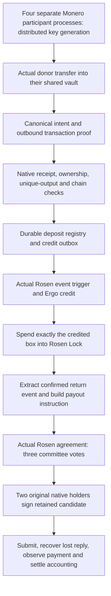

# Linked local roundtrip: implementation and evidence

A. Shannon · 13 September 2026

This is the baseline report for revision
[`93d169f`](https://github.com/a-shannon/docs/tree/93d169f58f5d9671831a0f5f5a8a62ad959ba555/r-and-d/monero-integration/roundtrip/source).
Its 308-file package and receipts remain historical evidence. The current
[watcher and guard authority report](watcher-authority.md) describes the subsequent
341-file package, actual watchers in both directions and distributed credit gate.

## Result

The linked candidate execution passed in **124.7 seconds**. It credited and
redeemed the exact observed obligation, produced one Monero payment, recovered a
lost submission reply and settled the input/disposition records. The native
checkpoint also passed **52 tests, zero failures**. These are local engineering
results under the specific assumptions below.

| Stage | Candidate transaction |
| --- | --- |
| Monero deposit | `da9c9c292254c0fb33495994b2f53eb93c8ab229115c51ea40391d23f3ced88c` |
| Ergo credit | `0ac3b455505567725fa28135e3c7c3b7c12f51fb1749ab60825a23b0dd3fd5d8` |
| Exact-box redemption | `520d749bb39ddf0679347f360b764b0079fb1a4453bbda0335b85af60bd36433` |
| Monero payout | `29bdf3311d6bbaa1114168b402ec80f05401317a6a1309b9c17fe046fff969da` |

These identifiers belong to the controlled local chains, not public explorers.
The [candidate receipt](evidence/candidate-roundtrip.json) records the amounts,
output and block identities, native scan and execution counters.

The **final published package also passed a fresh relocated run**: 121.2 seconds
for the linked test, with its complete declared input closure verified before
and after execution. Its [receipt](evidence/relocated-roundtrip.json) and
[replay qualification record](evidence/replay-qualification.json) bind that
result to the exact source manifest:

```text
308 source files, excluding the manifest itself
source-manifest.json SHA-256:
362021613e37f4dddbfae77d5bf0cc9611702d5e63a860d82f9d2a1f51c58558
ordinal file aggregate SHA-256:
c7e5e747534902484d0f80ca4f88f2207369e451aad46b38662d9dbd4dfd25c1
```

The replay record preserves earlier outcomes, including one successful linked
test whose launcher failed its closing input check. That run remains
unqualified; its suppressed exception prevents attributing a cause. The final
launcher records bounded failure categories and the final run passed. An
additional [observed module inventory](evidence/replay01-observed-modules.json)
records 1,929 source/path hashes from the first relocation; the
[proof provenance record](evidence/proof-provenance.json) records 63 resolved
linked libraries. These are observed closures, not a complete filesystem trace
or clean-build proof.

## Question and scope

The preliminary study identified a credible current-protocol integration path. This implementation tests the joins between its components: an actual Monero deposit, authenticated destination intent, durable unique allocation, an actual Ergo credit, redemption of that precise credit, Rosen payment agreement, native threshold signing and observed Monero settlement.

Two isolated chains are used: Monero 0.18.5.1 fakechain at hard-fork version 16 and Ergo 6.0.3 devnet, both without peers. Local mining supplies test funds. Mainnet address encoding used by the Monero fakechain does not make it mainnet; the fixture's payout request uses its explicit Testnet profile. Nothing in this experiment transfers live assets.

The native host is deliberately restricted to its isolated HF16 profile and a
bounded chain-history inspection. It is a qualification harness around reusable
components, not a mainnet service enabled by changing an RPC URL.

The custody engine uses `monero-wallet` 0.2.0 with its multisig feature, `modular-frost` 0.11.1 and PedPoP distributed key generation. It does not use the C++ wallet RPC multisig workflow. The C++ wallet's transaction-proof implementation is used separately to establish deposit intent. This division avoids treating success in one wallet implementation as proof that another wallet's entire integration works.

## The linked execution



### 1. Distributed custody and real deposit

Four child processes execute PedPoP key generation. Each retains its own resulting share. The parent transports authenticated protocol messages and pins the child identities as part of the local fixture bootstrap. It does not reconstruct an aggregate Monero spend key. This is process separation on one machine, not independent operators or machines.

An ordinary donor transaction sends **500,000,240 atomic units** to the newly generated vault. A separately mined, mature vault output supplies fee liquidity. Actual daemon outputs populate the rings; the fixture waits for maturity. The payment therefore exercises two actual inputs, including the observed deposit, rather than replacing the deposit with an unrelated spendable fixture.

The donor retains the transaction secret needed to generate the outbound proof. It is not exposed as a signing capability or as public protocol output. A standalone helper calls the actual C++ `get_tx_proof` / `check_tx_proof` transaction overloads with the exact canonical intent bytes. The successful proof is only one input to acceptance: native receipt, ownership, amounts and chain state are verified separately.

### 2. Deposit acceptance and one-time output accounting

The original native holders inspect the deposit without entering a signing round. Their inspection supplies the ownership/key-image construction and bounded canonical-history observation. The consumer checks the actual transaction bytes, inclusion block, maturity, unspent key image, output identity and an unchanged observation context.

Deposit acceptance uses the implemented `DepositRegistry`, its migrations, canonical decision and credit outbox. A permanent output identity prevents the same one-time output from authorizing another credit. The policy is not a wallet-balance delta. This is the boundary relevant to the duplicate-output/burning-bug concern: acceptance must retain economic output identity across repeated observations and conflicting requests.

The local policy applies 100 atomic units of bridge fee and 20 of network fee, producing **500,000,120 units** of the Ergo fixture asset. Amounts are integral and the configured conversion has no remainder. These fee values are functional fixtures, not a proposed production fee schedule.

Source acceptance is composed with a **`local-operator-v1` synthetic authority profile**. Native source evidence is real; the authority that admits it to the local credit workflow is not a production watcher quorum. The observation's vault address is a routing field, not a recovered Monero sender identity.

### 3. Actual Ergo credit and redemption

The fixture deploys parameterized Rosen contracts and issues their local token identifiers. Its watcher encoder constructs a real event-trigger box. The credit uses the actual `ErgoChain` transaction builder, order extractor and two-of-three guard signing against that trigger and the actual guard data input. The transaction must be accepted and confirmed by the Ergo node.

The user-side redemption consumes **the exact credited box**, verified by box identifier and input membership. It sends the credited asset into the actual Rosen Lock contract, including the requested Monero destination and fee terms. The actual Rosen lock extractor reads the confirmed transaction. A second event-trigger transaction retains the resulting source transaction, block, height, amounts, destination and WID lineage.

The raw trigger extractor includes storage metadata and does not add scanner height. The join supplies the actual trigger transaction's inclusion height and uses Rosen's existing `EventSerializer.fromEntity` to obtain its precise event shape. The strict withdrawal request schema remains unchanged; source-chain height still refers to the redemption transaction.

All four Ergo stages retain their canonical signed bytes, transaction ID and input reservation in SQLite **before submission**: deposit trigger, credit, redemption and return trigger. Lost replies are reconciled against the retained transaction. A reopened obligation reuses the same receipt and transactions. The fixture serializes execution and waits for an in-flight sender to finish before closing custody; a delivery timeout does not cancel that sender.

The locally funded triggers use a controlled fixture wallet. They do not prove normal watcher commitment accumulation, collateral, slashing or reward distribution. Cached Ergo confirmations also do not establish production reorganization handling.

### 4. Rosen agreement and original-holder Monero signing

The actual return event enters the strict payout-order builder, token mapping, request verification and Rosen agreement methods. The configured four-member local Rosen committee produces three valid indexed votes. These keys and the local transport/database facts are fixture inputs; the actual agreement and signature verification logic executes.

The resulting verified agreement capability authorizes the retained native candidate. Two of the **original DKG holders** perform the selected signing protocol. Each checks the ceremony, participants, attempt, source, proposal and certificate. The durable consumed marker is written and checked before the wallet signing call. Uncertainty after that point does not authorize a second signing attempt.

Proposal identity remains separate from the final Monero transaction hash. Recovery requires an independently retained expectation digest and retrieves the same verified final bytes; it does not reconstruct a fresh owner or regenerate a nonce. The native observer derives its scan context from that authenticated recovery anchor rather than an unanchored private view record.

### 5. Submission and economic settlement

The actual registered `MoneroPaymentLifecycle` runs through Rosen's `TransactionProcessor`. A deliberate fault discards the first submission reply after the Monero daemon has accepted the transaction. Reopening the lifecycle recovers the same bytes and observes the transaction in the pool without signing or submitting again.

After inclusion, native scanning checks the recipient, change, amount and conservation against the retained candidate. The consumer checks the configured genesis, transaction bytes, canonical inclusion and opening/closing tip markers. The final deciding read is the closing tip marker, preventing an intervening same-height tip change during the earlier closing network read from being concealed. These checks detect the tested schedules; they are not an atomic snapshot guarantee over several RPCs.

One confirmation leaves the payment `sent`; the fixture's required depth of two makes it `completed`. The same SQLite transaction preserves the original proposal, sets the event to `pending-reward`, marks reserved inputs spent and settles the disposition. Repeated processing must preserve this state. Two confirmations are a test parameter, not a production finality recommendation.

The requested return is **500,000,000 atomic XMR units**. The experiment also checks on the actual daemon that the source deposit's key image is spent. It does not claim every future deposit must be spent directly to satisfy its own redemption; that linkage is useful here as an integration witness.

## Validation boundaries

| Boundary | Decisive evidence | What it does not establish |
| --- | --- | --- |
| Transaction-proof semantics | Actual C++ valid proof and amount; changed canonical message, signature, transaction ID and extra field refuse | Compatibility with future proof formats or an end-user proof submission interface |
| Separate signing holders | Original four-party DKG; selected two-holder payout; wrong sender, crossed attempt and replay refused after observed round-5 progress | Distributed deployment, adversarial networking or all quorum/availability combinations |
| Signing uncertainty | Interrupted post-share signer has consumed state and cannot sign again; exact committed final recovery in positive path | Recovery that always remains live after losing a holder or its durable private state |
| Deposit uniqueness | Actual registry/outbox; duplicate replay and conflicting economic-output claim checks | Globally coordinated watcher authority, every historical burning-bug variant or rescan migration |
| Payment lifecycle | Real SQLite and actual processor; unsafe durability settings and stale asynchronous responses independently tested | PostgreSQL qualification or full service operational behavior |
| Source/settlement currentness | Independent isolated schedule tests for changed genesis, tip, block, height and last-marker drift | A live network reorganization campaign or atomic node snapshots |
| Ergo credit continuity | Actual credit and exact-box redemption; retained signed-byte retry and reopened duplicate receipt | Watcher collateral/rewards, broad concurrent worker operation or Ergo reorg recovery |
| Packaging | Exact source manifest, configuration relocation provenance and prepared dependency pins | Fresh dependency installation, independent binary reproduction or a supported release |

Independent focused reviews found and closed specific defects: unsafe SQLite journal/synchronous settings, stale callbacks regressing settled state, missing observation-genesis binding, closing-tip ordering, and a negative-test phase witness that could otherwise pass before fault injection. Later reviews checked the local trigger signer, sender lifetime and event projection. These are bounded engineering reviews, not an external security audit.

## Version and provenance limits

The source package pins the Rosen baseline, copied local changes, package metadata, prepared distribution inputs and configuration-only relocation differences. The source files and executable hashes are distinct evidence. Local deposit sources are shipped because checking out the Rosen baseline alone does not provide them.

The proof helper uses the Monero source revision `4f92268d7c16741cfb41e5bbe2aa46cc260a9ea5` in an existing research build with local modifications. The exercised transaction-proof overloads were inspected separately from those modifications. The helper and library pins identify the observed artifacts; a clean, independently reproducible Monero build has not been established. The prepared WSL runtime and its linked libraries remain part of the experimental environment.

The exact versions in the evidence are the scope of the result. No result here applies automatically to a newer dependency or to FCMP++/Carrot. The earlier [migration analysis](../preliminary-study/technical-report.md) remains relevant; this milestone makes no new upstream delivery-date prediction.

## What remains before a live bridge

1. **Production source authority and event transport.** Connect Monero observation, independently reproduced evidence, deposit intent publication and agreed uniqueness to Rosen's real watcher/guard workflow. Define rescan and reorganization behavior, not just the local receipt cache.
2. **Independent custody deployment.** Replace the parent-pinned local identity bootstrap and fixture transport with authenticated, independently operated participants; qualify durable share/nonce storage, backups, rotation and behavior when a selected holder disappears.
3. **Complete economic and operational accounting.** Reconcile backing, wrapped liabilities, fee liquidity, reservations, change and all still-executable historical payments. Qualify concurrent services, faults across the entire cycle, monitoring, recovery and resource limits.
4. **Protocol migration.** Demonstrate spendability and redemptions through the actual chosen future wallet path, including old vault state, outstanding payments, proof formats and emergency suspension/exit. Current-protocol success does not close this gate.
5. **Release qualification.** Produce clean pinned builds, independently replay the package in a fresh environment, integrate supported Rosen interfaces, run broader adversarial/node campaigns and obtain external review before exposing user funds.

The next useful integration increment is production source authority and real watcher transport around this demonstrated local execution path. It should preserve the existing proof, uniqueness, authorization and settlement contracts. That is a concrete engineering task; the remaining gates should not be collapsed into either “Monero is impossible” or “the bridge is ready.”
